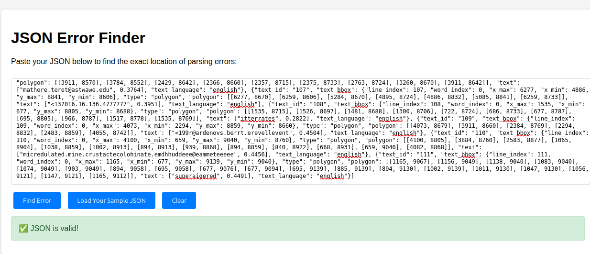
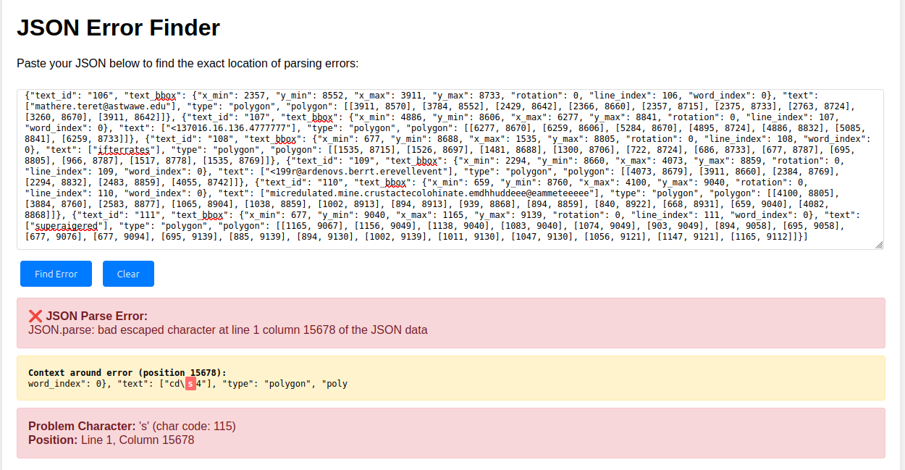

# JSON Error Finder

A simple, lightweight web tool to quickly identify and locate JSON parsing errors with precise character-level highlighting.

## Features

- **Instant Error Detection** - Identifies JSON syntax errors in real-time
- **Precise Location** - Shows exact line and column position of errors
- **Context Highlighting** - Highlights the problematic character with surrounding context
- **Character Analysis** - Displays character codes for debugging invisible characters
- **Escape Sequence Tips** - Provides helpful hints for common escape character issues

## Screenshots

### Error Detection

*Example showing how the tool highlights JSON parsing errors with context*

### Valid JSON Confirmation

*Clean interface confirming when JSON is properly formatted*

## Usage

1. Open `index.html` in any modern web browser
2. Paste your JSON content into the textarea
3. Click "Find Error" to analyze
4. View detailed error information with highlighted problem areas

## Perfect For

- Debugging API responses
- Validating configuration files
- Troubleshooting data imports
- Learning JSON syntax

## No Dependencies

Pure HTML, CSS, and JavaScript - works offline and requires no installation.